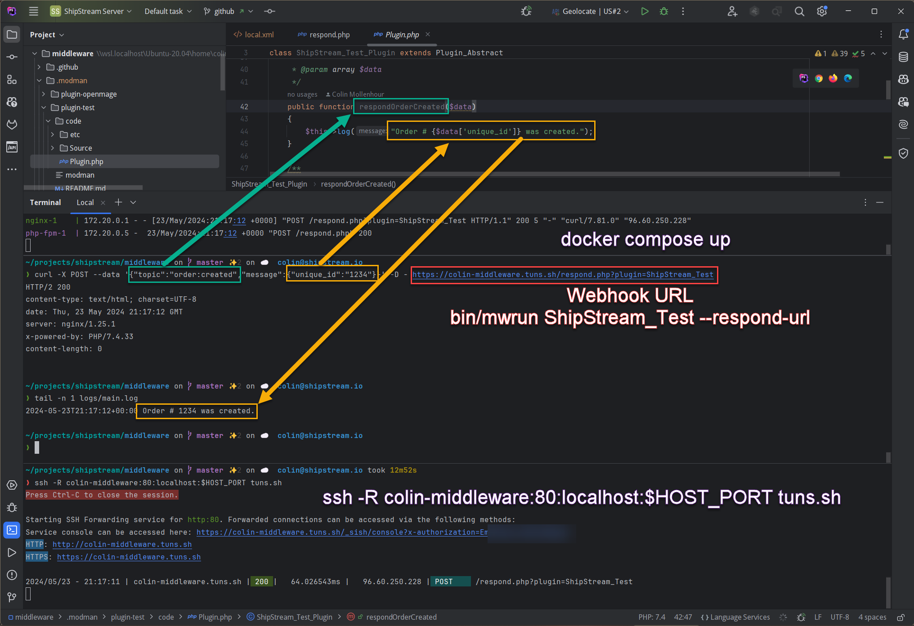

ShipStream Merchant Plugin Middleware
=====================================

The ShipStream Merchant Plugin Middleware is a lightweight, abstracted version of ShipStream's production
environment. With it, you can develop and test plugins destined to become integrated ShipStream WMS plugins,
or use it as a standalone "middle-man" app between your systems and ShipStream.

## Table of Contents

- [Features](#features)
  - [Subscriptions](#subscriptions)
- [Requirements](#requirements)
  - [Windows](#windows)
  - [Mac](#mac)
- [Installation](#installation)
  - [Advanced](#advanced)
  - [HTTPS Tunnel](#https-tunnel)
- [Developer Guide](#developer-guide)
  - [Debug Mode](#debug-mode)
  - [Plugin Skeleton](#plugin-skeleton)
    - [Plugin Class](#plugin-class)
    - [modman](#modman)
    - [Register Plugin](#register-plugin)
    - [config.xml](#configxml)
    - [plugin.xml](#pluginxml)
    - [system.xml](#systemxml)
  - [Plugin Information](#plugin-information)
  - [Plugin Configuration](#plugin-configuration)
    - [config.xml](#configxml-1)
    - [plugin.xml](#pluginxml-1)
    - [system.xml](#systemxml-1)
  - [Activation](#activation)
  - [ShipStream API Calls](#shipstream-api-calls)
  - [HTTP Client](#http-client)
  - [State Management](#state-management)
  - [Manual Actions](#manual-actions)
    - [Hiding actions](#hiding-actions)
  - [Cron Tasks](#cron-tasks)
  - [ShipStream Events](#shipstream-events)
    - [Installation](#installation-1)
    - [Subscribing to topics](#subscribing-to-topics)
  - [Third-party Webhooks](#third-party-webhooks)
  - [Third-party Remote Callbacks](#third-party-remote-callbacks)
  - [Error Handling and Reporting](#error-handling-and-reporting)
  - [Job Queue](#job-queue)
    - [Instant run](#instant-run)
  - [Global Locking](#global-locking)
  - [Logging](#logging)
  - [Caching](#caching)
  - [OAuth](#oauth)
  - [Diagnostics](#diagnostics)
  - [Composer Dependencies](#composer-dependencies)
- [Merchant API Documentation](https://docs.shipstream.io) (external link)

Features
--------
ShipStream Merchant Plugins support the following features which work exactly the same in both the middleware
environment (this repository) and the production environment (ShipStream WMS).

* Interact with ShipStream's [Merchant API](https://docs.shipstream.io) either as an embedded plugin or over https
* Easily add configuration fields to the GUI
* Run actions on demand
* Run actions periodically via cron jobs
* Respond to ShipStream events in real time (via Webhooks if using the middleware environment)
* Respond to third-party webhook events and remote callbacks
* Queue tasks to be executed in the background with error reporting and user-directed retries
* Use state management and caching for ease of use and efficiency
* Global locking to solve tricky race conditions
* Perform OAuth authentication via command line or web browser

A plugin that is installed on the production environment can be configured by the user via the Merchant Panel as a
"Subscription" or run in the middleware environment with a very simple installation using Docker Compose.
Either way, the functionality of the plugin should be identical. While the "middleware" is intended to be mainly a
development environment, you can just as well use it as the basis for your integration or as a standalone app on
your own hosting environment.

### Subscriptions

In the production environment a plugin runs in the context of a single merchant after being added as a "Subscription"
via the ShipStream Admin or Client user interface. A merchant can have multiple subscriptions and the configuration and
state data is not shared between subscriptions even if they are used by the same merchant or use the same key names
(state keys are namespaced to each subscription to avoid conflicts). Keep this in mind while developing the plugin as
there may be legitimate use cases for a single merchant having multiple subscriptions installed, such as if they use
multiple brands names and have a separate shopping cart for each brand name.

Requirements
------------

A fully operational development environment is provided by [Docker](https://docs.docker.com/get-docker/) and
[Docker Compose](https://docs.docker.com/compose/install/).

A publicly accessible URL is required if your plugin receives third-party webhooks or responds to events from
ShipStream via ShipStream's webhooks. For development environments this can be obtained easily and for free with
[ngrok](https://ngrok.com) or [localhost.run](https://localhost.run). 

### Windows

Developing on Windows requires bash and therefore [WSL2 (Windows Subsystem for Linux)](https://docs.microsoft.com/en-us/windows/wsl/install-win10)
and [Docker Desktop for Windows](https://docs.docker.com/docker-for-windows/install/) are recommended.

### Mac

Developing on Mac requires [Docker Desktop for Mac](https://docs.docker.com/docker-for-mac/install/).


Installation
------------

1. Clone this repository to a new directory and update files permissions and install dependencies:
   ```
   $ git clone https://github.com/shipstream/middleware.git
   $ cd middleware
   $ chmod go+rwX tmp logs
   $ bin/update
   ```
   
2. Copy and edit the sample config file to add your configuration:
   ```
   $ cp app/etc/local.sample.xml app/etc/local.xml
   ```
   Example:
   ```xml
   <?xml version="1.0"?>
   <config>
     <default>
       <middleware>
         <system>
           <base_url>http://localhost/</base_url>
           <app_title>ACME Fulfillment</app_title>
           <log>stdout</log>
           <timezone>America/New_York</timezone>
         </system>
         <api>
           <base_url>https://example.shipstream.app/api/jsonrpc</base_url>
           <login>{api_username}</login>
           <password>{api_password}</password>
           <secret_key>{secret_key}</secret_key>
         </api>
       </middleware>
     </default>
   </config>
   ```
   
3. Clone the `ShipStream_Test` plugin and run the `update_ip` method to confirm a successful setup!
   ```
   $ bin/modman init
   $ bin/modman clone https://github.com/shipstream/plugin-test.git
   $ bin/mwrun ShipStream_Test update_ip
   Creating middleware_cli_run ... done
   Agent 007's IP is x.x.x.x, last updated at 2020-01-19T14:41:23+00:00.
   ```

The source code for the `ShipStream_Test` plugin will be located at `.modman/plugin-test`.

### Advanced

You can use a `.env` file in the root of the project to set some configuration options:

- `DEBUG` Enable for HTTP request logging and other debug features (default is disabled).
- `HOST_PORT` Choose a different port to expose (default is 80).

### HTTPS Tunnel

If you need to support callbacks and webhooks from systems not in your local development environment you need your
url to be publicly accessible. One easy and free way to accomplish this is to use [ngrok](https://ngrok.com) or [localhost.run](https://localhost.run)
which are simple tunneling services. The ngrok service uses its own command line interface and is more robust, while
localhost.run only requires the common `ssh` command.

```
$ ngrok http 80
```

Or:

```
$ ssh -R 80:localhost:80 nokey@localhost.run
```

If you changed the `HOST_PORT` in
your `.env` file you will need to specify the correct port in the ssh command:

```
$ source .env
$ ngrok http $HTTP_PORT
```

Or:

```
$ source .env
$ ssh -R 80:localhost:${HOST_PORT} nokey@localhost.run
```

Upon a successful connection, you will be given a unique domain name like `4c0dfddeedc0d8.lhr.life`. On the free
plans this will only last a few hours before it needs to be refreshed with a new domain name. Use this url in the
`app/etc/local.xml` config file for the `default/middleware/system/base_url` value:

```xml
<?xml version="1.0"?>
<config>
    <default>
        <middleware>
            <system>
                <base_url>https://4c0dfddeedc0d8.lhr.life/</base_url>
                ...
            </system>
            ...
        </middleware>
    </default>
</config>
```

***NOTE:***
If you update your `base_url`, you may need to also re-register that url for any plugins that make use of callbacks. 

Developer Guide
===============

The easiest way to start your own plugin is to fork the [`ShipStream_Test`](https://github.com/shipstream/plugin-test)
project which you would have cloned in step 3 and then rename and edit it as needed.

## Debug Mode

Debug mode can be enabled in one of the following ways:

- Use the DEBUG environment variable when running a command
  ```
  $ DEBUG=1 bin/mwrun ShipStream_Test update_ip
  ```
- Pass the `--debug` argument at the end of a command
  ```
  $ bin/mwrun ShipStream_Test update_ip --debug
  ```
- Set the DEBUG environment variable in the `.env` file
  ```
  $ echo 'DEBUG=1' >> .env
  ```

## Plugin Skeleton

The minimal required file structure from the root of the middleware directory is as follows:

* app/code/community/{COMPANY_NAME}/{MODULE_NAME}
  * etc
    * config.xml
    * plugin.xml
    * system.xml
  * Plugin.php
* app/etc/modules
  * {COMPANY_NAME}_{MODULE_NAME}.xml
* modman

Additional libraries and files may be added within the module directory as necessary and autoloaded using either
the underscore separated path name convention for autoloading or composer autoloading.

### Plugin Class

The bulk of your plugin logic will exist in a PHP class which extends `Plugin_Abstract` and implements
`Plugin Interface`. These classes expose a common interface allowing the plugin to be transferable between
the middleware and production environments. The file name is `Plugin.php` and the class name follows PSR-1
naming conventions so for example the `Plugin.php` file for the `ShipStream_Test` plugin would exist at
`app/code/community/ShipStream/Test/Plugin.php` and contain the class definition like so:

```php
<?php

class ShipStream_Test_Plugin extends Plugin_Abstract
{
    // ...
}
```

### modman

Rather than mix your plugin files into the middleware environment it is recommended to use `bin/modman`
to symlink the files into the project directories so the `modman` file for the `ShipStream_Test` plugin
may look like this:

```
code                   app/code/community/ShipStream/Test/
ShipStream_Test.xml    app/etc/modules/
```

After modifying the modman file be sure to run the `modman deploy` command to update symlinks:

```
$ bin/modman deploy-all
```

### Register Plugin

The plugin is registered to the production environment using an XML file placed in `app/etc/modules` named after the
plugin namespace. This file is not required for the middleware environment to function.

Example file contents for `app/etc/modules/ShipStream_Test.xml`:

```xml
<?xml version="1.0"?>
<config>
    <modules>
        <ShipStream_Test>
            <codePool>community</codePool>
            <active>true</active>
        </ShipStream_Test>
    </modules>
</config>
```

### config.xml

The `config.xml` is used to set the plugin version and the default configuration values. Here is a `config.xml` example
for the `ShipStream_Test` plugin which sets the version to '0.1' and adds some default configuration values.

```xml
<?xml version="1.0"?>
<config>
    <modules>
        <ShipStream_Test>
            <version>0.1</version>
        </ShipStream_Test>
    </modules>
    <default>
        <plugin>
            <ShipStream_Test>
                <whoami>Your Name</whoami>
                <service_url>http://ipinfo.io/ip</service_url>
                <events>
                    <order>
                        <created>1</created>
                    </order>
                </events>
            </ShipStream_Test>
        </plugin>
    </default>
</config>
```

See the [ShipStream Events](#shipstream-events) section for more on the `<events>` node and [plugin.xml](#pluginxml)
for more on making the configuration accessible to the user.

### plugin.xml

The `plugin.xml` file provides the remaining plugin metadata in the following nodes:

- `<info>` Plugin information and feature flags ([Plugin Information](#plugin-information))
- `<actions>` Buttons that the user can click in the UI to trigger manual actions. ([Manual Actions](#manual-actions))
- `<config>` Form fields that will be presented to the user for configuring the subscription ([Plugin Configuration](#plugin-configuration) > [plugin.xml](#pluginxml-1))
- `<routes>` Definition of urls which should map to plugin method for receiving external requests
  ([Third-party Remote Callbacks](#third-party-remote-callbacks))
- `<crontab>` Cron tasks which will be automatically run in the production environment ([Cron Tasks](#cron-tasks))

### system.xml

The `system.xml` file is used to define the configuration fields for the whole system rather than a specific instance
of the plugin. That is, all plugin subscriptions will share the same configuration values defined in this file and only
administrators will be able to set the values. This file is not always required, but is typically used for things like
OAuth 2.0 app credentials or other global settings. See [system.xml](#systemxml-1) for more information.

## Plugin Information

The plugin information is defined in the `<info>` node of the `plugin.xml` file under the correct namespace
(e.g. `<SchipStream_Test>`).

The name, author, license and description fields may be presented to the user when creating or editing a subscription.

The `<oauth>` node defines if OAuth is enabled and which config nodes are required to have non-empty values in order
for OAuth authentication to be attempted. See [OAuth](#oauth) for more info.

```xml
<?xml version="1.0" encoding="utf-8"?>
<plugin>
    <ShipStream_Test>
        <info>
            <name>Test Plugin</name>
            <author>ShipStream, LLC</author>
            <license>
                <name>OSL 3.0</name>
                <url>http://opensource.org/licenses/osl-3.0.php</url>
            </license>
            <homepage>https://github.com/shipstream/plugin-test</homepage>
            <description><![CDATA[
                This is a <em>barebones</em> example to demonstrate what a plugin looks like.
            ]]></description>
            <oauth>
                <enabled>1</enabled>
                <required_config>whoami</required_config>
            </oauth>
        </info>
        <!-- ... -->
    </ShipStream_Test>
</plugin>
```

The plugin info can be accessed in the PHP plugin code using the `getPluginInfo` method:

```php
$name = $this->getPluginInfo('info/name');
// $name = 'Test Plugin'
```

However, data that does not have to do with the plugin description or OAuth configuration belongs in the `config.xml`
file (see [Plugin Configuration](#plugin-configuration)).

## Plugin Configuration

The `<default>` node in `config.xml` allows you to organize configuration that has default values but can be also
manipulated by users through the ShipStream user interface.

Configuration that is highly sensitive can be encrypted in storage by defining the value with the "backend_model"
attribute. Note, however that encrypted values will not be visible to users so if the configuration field does not pose
a security threat by being visible to users it may be preferable to leave it unencrypted for convenience to the user.

The user interface for the configuration is defined in `plugin.xml` for instance-specific configuration and `system.xml`
for global configuration using matching node names. For example, the default value for the `whoami` config field defined
at `config/default/plugin/ShipStream_Test/whoami` in `config.xml` corresponds to the field definition at
`plugin/ShipStream_Test/config/whoami` in `plugin.xml` and the default value for the `fulfillment_service` field defined
at `config/default/plugin/ShipStream_Test/fulfillment_service` in `config.xml` corresponds to the field definition at 
`config/sections/plugin/groups/ShipStream_Test/fields/fulfillment_service` in `system.xml`.

Each config field definition can contain the following elements:

- `<label>` The name of the field presented to the user
- `<type>` The type of field presented to the user. Supported types are: 'text', 'url', 'email', 'tel', 'date', 
  'time', 'password', 'obscure', 'textarea', 'date', 'select', 'script'
- `<sort_order>` The sort order of the field relative to other fields (lowest first)
- `<source>` Required only for 'select' type fields, this is the source model for the options which is a class name
  containing a method with a signature like `public function getOptions(Plugin_Abstract $plugin)` which will return
  an array of options (e.g. `return [['label' => 'Zero', 'value' => '0']]`).
- `<comment>` A comment that will appear below the field to give additional context to the user. May contain HTML; use
CDATA to avoid character encoding issues in the XML file.
  
### config.xml

```xml
<?xml version="1.0"?>
<config>
    <default>
        <plugin>
            <ShipStream_Test>
                <whoami>Your Name</whoami>
                <service_url>http://ipinfo.io/ip</service_url>
                <fulfillment_service>ShipStream</fulfillment_service>
                <secret_key backend_model="adminhtml/system_config_backend_encrypted"/>
            </ShipStream_Test>
        </plugin>
    </default>
</config>
```

### plugin.xml

```xml
<?xml version="1.0" encoding="utf-8"?>
<plugin>
    <ShipStream_Test>
        <!-- ... -->
        <config>
            <whoami>
                <label>Who Am I</label>
                <type>text</type>
                <sort_order>0</sort_order>
                <comment>Enter a name. Be creative.</comment>
            </whoami>
            <service_url>
                <label>Service Url</label>
                <type>select</type>
                <source>ShipStream_Test_Source_Serviceurl</source>
                <sort_order>10</sort_order>
                <comment>Choose the service to use to discover your IP address.</comment>
            </service_url>
            <secret_key>
                <label>Secret Key</label>
                <type>obscure</type>
                <sort_order>20</sort_order>
                <comment>Just demonstrating an obscured input field.</comment>
            </secret_key>
        </config>
    </ShipStream_Test>
</plugin>
```

### system.xml

Like `plugin.xml`, the fields defined in this file correspond to the default config values that may be set in `config.xml`
and just allow the configuration to be set via the Admin UI, so it only affects the rendering of the configuration
pages and not the values in any way.

```xml
<?xml version="1.0"?>
<config>
  <sections>
    <plugin>
      <groups>
        <!-- Section name must be exact same as the plugin name so that plugin code can read it -->
        <ShipStream_Test translate="label" module="plugin">
          <label>Test Plugin</label>
          <sort_order>900</sort_order>
          <show_in_default>1</show_in_default>
          <comment><model>ShipStream_Test_GroupComment</model></comment>
          <sort_fields>
            <by>label</by>
          </sort_fields>
          <fields>
            <fulfillment_service translate="label" module="plugin">
              <label>Fulfillment Service Name</label>
              <sort_order>0</sort_order> <!-- Sort order relative to other fields if sort_fields->by is not specified -->
              <show_in_default>1</show_in_default>
              <comment><![CDATA[
                            The name for the Fulfillment Service and Location to register in the Shopify store.<br/>
                            <b>Warning:</b> If this value is changed you will need to Deactivate and Activate all
                            subscriptions and all associated products and open fulfillments will be disassociated.
                            ]]></comment>
            </fulfillment_service>
          </fields>
        </ShipStream_Test>
      </groups>
    </plugin>
  </sections>
</config>
```

The `config/sections/plugin/groups/{Plugin_Namepsace}/fields/{field_name}` nodes may contain child nodes such as:

- `label` – The label of the configuration field
- `sort_order` – The field position inside the configuration group
- `frontend_type` - The field input type for displaying of the form item. If a value is not specified, the `text` input type will be used. Common values are:
  - `text` – Text input field
  - `textarea` – Textarea field
  - `select` – Dropdown field. Options for this field are retrieved from `source_model`
  - `multiselect` – Multiselect field. Options for this field are retrieved from `source_model`
  - `obscure` - A password input that displays only a masked value. You must also specify `<backend_model>adminhtml/system_config_backend_encrypted</backend_model>`
    for the field in `system.xml` and ` backend_model="adminhtml/system_config_backend_encrypted"` for the field in `config.xml`.
- `can_be_empty` – Indicates that multiselect field can contain no values selected, otherwise empty selection will not be saved
- `source_model` – Specifies the source model that returns option list for select and multiselect fields types. List of mostly used source models:
  - `adminhtml/system_config_source_locale_country` – returns list of localized country names
  - `adminhtml/system_config_source_enabledisable` – return list of two options (“Enable” and “Disable”)
  - `adminhtml/system_config_source_notoptreq` – return list of three options: ("Not", "Optional", "Required")
  - `adminhtml/system_config_source_yesno` – return boolean options (“Yes”, “No”)
- `show_in_default` - Should pretty much always be set to 1
- `tooltip` – A tooltip text for the field. This text is displayed when the mouse is over the field. If you want to specify custom html block for text in tooltip, you should use `tooltip_block`
- `tooltip_block` – A block class name that will be used as tooltip for this field instead of tooltip text
- `validate` - A CSS class name that will be applied to form field. Used for validation of the field input. Some usual values:
  - `required-entry` – validates field value as non empty
  - `validate-number` – validates field value as numeric
  - `validate-email` – validates field value as valid email address 
- `comment` - Text that will be displayed below the form field. Also, this field can use a comment generator model in which case you need specify the following children for it:
  - `model` – The model class name that should implement the `getCommentText()` method with public access. Parameters those are passed to this method are the following:
    - `$element` – configuration node itself
    - `$currentValue` – current field value
- `depends` – This node contains a list of dependencies of the current field to other fields. The structure of this node is very simple. The child node name is name of field on what this one depends, and the node value is value for make this field visible. For example such configuration:
  ```
  <depends>
      <field_name>1</field_name>
  </depends>
  ```
  will add a rule for displaying of the current field only if the value of field called “field_name” equals to 1.

## Activation

A plugin may optionally implement some methods which aid in initializing the plugin state when it is created, and
destroying it when it is deactivated. For example, it may need to register a webhook with the integration and
then unregister the webhook when it is deactivated to prevent the webhook from continuing to fire when the
plugin is no longer active.

- `hasActivation(): bool` - Return `true` if the `activate()` method needs to do anything upon activation.
- `activate(): string[]` - Return an array of messages for the end-user.
- `deactivate(): string[]` - Return an array of messages for the end-user.
- `reinstall(): array` - Non-destructively update the plugin state - for example, will be run if the public url is updated so that webhooks and callbacks can be updated.

## ShipStream API Calls

You may call ShipStream API methods from the plugin using the `call` method so there is no need to deal with
an HTTP client or authentication. In production this will call methods directly and in the middleware environment
there will be a synchronous HTTP request for every invocation, but the return values will be the same.

See the **[API Documentation](https://docs.shipstream.io)** for information on specific API methods and their
arguments and responses.

Example:

```php
/* @var $this Plugin_Abstract */
$inventory = $this->call('inventory.list', 'SKU-A');
// [['sku' => 'SKU-A', 'qty_advertised' => '0.0000', ...]]
```

## HTTP Client

Use the `getHttpClient` method to obtain an instance of `\GuzzleHttp\Client`. This allows the production environment
to perform proper logging and monitoring to ensure optimum functionality. The Guzzle client is very versatile, so it
is recommended to wrap it as needed or use it as-is, but avoid using other http clients as they may not be supported.

```php
/* @var $this Plugin_Abstract */
/* @var $client \GuzzleHttp\Client */
$client = $this->getHttpClient([
    'base_uri' => 'http://requestbin.net/r/chs4u8vm',
    'auth' => ['username', 'password'],
]);
$response = $client->get('/test', ['query' => ['foo' => 'bar']]);
$response->getStatusCode(); // 200
```

The request and response will be logged to `logs/http_client.log` if [debug mode](#debug-mode) is enabled.

See the [Guzzle Documentation](https://docs.guzzlephp.org/en/stable/quickstart.html) for more information.

## State Management

ShipStream provides a general-purpose storage mechanism to hold state data like the last time a sync was completed.
Do *not* use this to store an unbounded number of values or values that will be "leaked" over time such as a status for
every order. For example, if your plugin registers a webhook with a third-party you could store the id of the webhook
so that it can be easily updated or deleted later.

This state data is properly namespaced so it cannot conflict with or be ready by other plugin subscriptions.

```php
$this->setState('test', array(
    'my_name' => $this->getConfig('whoami'),
    'last_updated' => time(),
));

$data = $this->getState('test');
$this->log("{$data['my_name']} last updated at ".date('c', $data['last_updated']).".");
```

## Manual Actions

Any public plugin method can be run by executing the following command in the command line specifying the plugin
namespace and method name. You can also allow the user on production to trigger methods manually by defining an "action"
node in the `plugin.xml` file which will render a button on the Subscription page. 

For example, running the following console command is equivalent to the user clicking "Update IP" in the user interface,
both will run the `update_ip` method defined in the PHP class with the proper environment context.

```
$ bin/mwrun ShipStream_Test update_ip
```

plugin.xml:

```xml
<?xml version="1.0" encoding="utf-8"?>
<plugin>
    <ShipStream_Test>
        <!-- ... -->
        <actions>
            <update_ip>
                <label>Update IP</label>
                <comment>Update the IP address stored in the plugin state data.</comment>
            </update_ip>
        </actions>
    </ShipStream_Test>
</plugin>
```

### Hiding actions

By specifying a plugin method name in either an `<if>` or `<unless>` node for the action the presence of the
button in the user interface can be disabled to hide actions that are not applicable. For example, you
could hide a "Upgrade Plugin" button if the upgrade has already been performed by adding a node
`<unless>hasUpgradeBeenPerformed</unless>` and implementing a method with the same name which returns true
if the upgrade has already been performed.

## Cron Tasks

If just hacking on a plugin, you do not need to schedule a crontab task; you can just run the cron task methods
using `mwrun` as any other method. If you want to schedule a crontab task in the production environment you can do
so by defining a task in `plugin.xml`. The available schedules are:

- every_five_minutes
- every_ten_minutes
- every_one_hour
- every_day_midnight
- every_day_morning
- every_day_evening

For example, the task defined in this `plugin.xml` file will run the method
`ShipStream_Test_Plugin::cronImportFulfillments` every ten minutes.

```xml
<?xml version="1.0" encoding="utf-8"?>
<plugin>
    <ShipStream_Test>
        <!-- ... -->
        <crontab>
            <every_ten_minutes>
                <import_fulfillments>cronImportFulfillments</import_fulfillments>
            </every_ten_minutes>
        </crontab>
    </ShipStream_Test>
</plugin>
```

An important consideration when using cron tasks is to ensure that the time between tasks is significantly greater than
the time required to complete the task once in a worst-case scenario. Use webhooks and events to make your integration
nearly real-time where possible and use polling and batch jobs only as a fallback if possible.

If you need a cron schedule that is not provided please request it with an explanation for your use-case.

## ShipStream Events

Your plugin can receive immediate notifications from ShipStream with valuable metadata which can make developing an
effective integration much easier and with the end result being much more robust. The events the plugin can receive
are the same as the [Webhook Topics](https://docs.shipstream.io/ref/topics.html) and in fact the middleware environment
uses webhooks to receive these events.

### Installation

To receive ShipStream Events, Callbacks and generic Webhooks in the middleware environment you will need your Docker
container to be accessible by the ShipStream instance over http(s) and to know the url that can be used to reach your
local environment. For example, if your ShipStream instance is local it could be `http://localhost/` or if it is remote
it could be your public site address or a reverse proxy running an [SSH Tunnel](https://github.com/ShipStream/middleware#https-tunnel) to your localhost.

#### Webhook setup

Since the middleware environment runs by itself, to receive events from ShipStream you must setup a webhook in ShipStream
for the events you wish to receive. The following steps will guide you through the process:

1. Configure the correct url for your environment in `app/etc/local.xml` at the `middleware/system/base_url` config node. This is the public url of your development environment.
2. Run `bin/mwrun <your-plugin> --respond-url` to get the full url for the webhook endpoint. This is the base url plus the path and query parameters needed to route the request.
3. Test that the url is reachable as expected using `curl`. For example: `curl -X POST --data '{"topic":"order:created","message":{"unique_id":"1234"}}' -D - "$(bin/mwrun ShipStream_Test --respond-url)"`
4. Verify that the request was received by inspecting `logs/webhooks.log` and `logs/main.log` for any errors.
5. Add a webhook to ShipStream at System > Plugins > Webhooks > Create Webhook using your url from step 2 with the topics that your plugin shall respond to.
6. Click the newly added Webhook and click "Send Test Event" to verify a successful connection
7. Inspect `logs/webhooks.log` to verify the webhook was received

**If your public url changes (such as is common when using the free version of ngrok) you will need to update the Webhook Url in ShipStream accordingly (steps 1 and 2).**



### Subscribing to topics

To receive an event for a topic, add the XML elements into your `config.xml` file corresponding to the event topic
you would like to receive. For example, to receive the `order:created` topic, your `config.xml` file would look like this:

```xml
<?xml version="1.0"?>
<config>
    <default>
        <plugin>
            <ShipStream_Test>
                <events>
                    <order>
                        <created>1</created>
                    </order>
                </events>
            </ShipStream_Test>
        </plugin>
    </default>
</config>
```

Create a method in your `Plugin.php` file by camel-casing the topic name and prefixing the method name with 'respond'.

```php
class ShipStream_Test_Plugin extends Plugin_Abstract
{
    /**
     * Respond to order:created events.
     *
     * @param array $data
     */
    public function respondOrderCreated($data)
    {
        $this->log("Order # {$data['unique_id']} was created.");
    }
}
```

## Third-party Webhooks

You may receive webhooks from third-party sources as well by defining the necessary methods which verify and handle
the webhook request and payload.

The url to use when registering webhooks with a third-party can be generated using the `getWebhookUrl` method. An
optional `$method` parameter allows you to ensure the url ends with a specific string or to ensure it is unique.

```php
$url = $this->getWebhookUrl('someTopic');
```

Or via the CLI:

```
$ bin/mwrun ShipStream_Test --webhook-url
```

The following example demonstrates how to handle Shopify webhooks using HMAC to verify the authenticity for security:

```php
class ShipStream_Test_Plugin extends Plugin_Abstract
{
    /**
     * Return FALSE if the webhook cannot be verified to prevent further execution
     * 
     * @param array  $query
     * @param array  $headers
     * @param string $data
     * @return bool
     */
    public function verifyWebhook($query, $headers, $data)
    {
        $calculated_hmac = base64_encode(hash_hmac('sha256', $data, $this->getConfig('oauth_api_secret'), true));
        $hmac_header = $headers['X_SHOPIFY_HMAC_SHA256'];
        return strcmp($hmac_header, $calculated_hmac) === 0;
    }

    /**
     * Return TRUE if the webhook was handled successfully.
     * 
     * @param array  $query
     * @param array  $headers
     * @param string $data
     * @return bool
     * @throws Plugin_Exception
     */
    public function handleWebhook($query, $headers, $data)
    {
        $data = @json_decode($data, TRUE);
        if (NULL === $data || json_last_error() != JSON_ERROR_NONE) {
            throw new Plugin_Exception('An error occurred while decoding JSON encoded string.');
        }

        switch (str_replace('.', '/', $query['topic']))
        {
            case 'fulfillments/create':
                $this->fulfillmentCreateWebhook($data);
                return TRUE;
        }
        return FALSE;
    }

    /**
     * Fulfillment create webhook callback
     *
     * @param string $data
     * @return void
     * @throws Plugin_Exception
     */
    public function fulfillmentCreateWebhook($fulfillmentData)
    {
        if (empty($fulfillmentData['order_id'])) {
            throw new Plugin_Exception('Unknown order id.');
        }
        $orderId       = $fulfillmentData['order_id'];
        $fulfillmentId = $fulfillmentData['id'];
        $orderName     = preg_replace('/\.\d$/', '', $fulfillmentData['name']);

        if ($fulfillmentData['status'] != 'pending') {
            $this->log(sprintf('Skipping import of fulfillment %s with status %s', $fulfillmentId, $fulfillmentData['status']));
            return;
        }

        $this->addEvent('importFulfillmentEvent', ['order_id' => $orderId, 'fulfillment_id' => $fulfillmentId, 'order_name' => $orderName]);
        $this->log(sprintf('Webhook queued import for order %s, fulfillment %s', $orderId, $fulfillmentId));
    }
}
```

It is important to note that many webhook systems have retries and expect to receive a success response within a short
amount of time, so it is advised to use the [job queue](#job-queue) to perform any potentially long-running work in
the background. The middleware environment doesn't have a real job queue mechanism, so the jobs will be executed in the
foreground.

## Third-party Remote Callbacks

Similarly to webhooks you can register specific callback methods which can be executed remotely. The primary difference
between webhooks and remote callbacks is that the latter maps one url to a specific method and the method can return
a payload in the HTTP response (vs just a 200 status).

Generate the url for the callback using `getCallbackUrl` and map this public method name to the
plugin's PHP method using the `plugin.xml` file.

```php
$url = $this->getCallbackUrl('testCallback');
```

plugin.xml:

```xml
<?xml version="1.0" encoding="utf-8"?>
<plugin>
    <ShipStream_Test>
        <routes>
            <testCallback>myCallbackMethod</testCallback>
        </routes>
    </ShipStream_Test>
</plugin>
```

```php
class ShipStream_Test_Plugin extends Plugin_Abstract
{
    public function myCallbackMethod($query, $headers, $data)
    {
        $rawData = $data;
        try {
            $data = json_decode($data, TRUE);
            if (NULL === $data || json_last_error() != JSON_ERROR_NONE) {
                throw new Plugin_Exception('An error occurred while decoding JSON encoded string.');
            }

            // Perform data validation
            if ( ! isset($data['payload'])) {
                throw new Plugin_Exception('Invalid data format.');
            }

            // Do something...
            
            $this->resolveError($rawData);
            return json_encode(['success' => TRUE]);
        } catch (Plugin_Exception $e) {
            $this->log($e->getMessage(), self::ERR, 'myCallbackMethod.log');
        } catch (Exception $e) {
            $this->log(get_class($e).': '.$e->getMessage(), self::ERR, 'myCallbackMethod.log');
            $this->logException($e);
        }
        $this->reportError($e, $rawData, TRUE, 'My Callback');
        throw $e;
    }
}
```

The callback url should be automatically registered with the third-party, but you can get the url generated for testing
with the following command:

```
$ bin/mwrun ShipStream_Test --callback-url testCallback
```

## Error Handling and Reporting

The only exception class that should be thrown from a plugin is `Plugin_Exception`, all other exceptions should be
caught and handled internally and re-thrown with `Plugin_Exception` passing the original exception as the third
parameter (`$previousException`). These exceptions may be visible to the end users so they should not contain sensitive
data, and they should be clear and descriptive to help end users understand what the problem is.

On the production environment, errors may be reported to the user through the ShipStream Admin UI and Client UI allowing
the user to view the error information in a grid using the `reportError` method. If an error is automatically resolved
due to an issue being fixed externally or by an automatic retry, your plugin should mark it as resolved using the
`resolveError` method. Errors are identified using a hash of the raw data passed when the error is recorded so they
cannot be duplicated. To mark an error resolved you **must** pass the same raw data that was originally passed when the
error was reported.

```php
$rawData = json_encode($data);
try {
    $this->doSomething($data);
    $this->resolveError($rawData);
} catch (Plugin_Exception $e) {
    $this->reportError($e, $rawData, TRUE, 'Do Something');
}
```

On the middleware environment the `reportError` and `resolveError` methods will have no effect other than to log the
error to `logs/errors.log`.

Any methods that use the Job Queue (described below) will automatically report errors and resolve errors based on if
the event callback throws an error (error is reported) or not (error is resolved). So for job queue callbacks just
throw or re-throw a `Plugin_Exception` rather than reporting and resolving errors directly. 

## Job Queue

For any actions that may take a significant amount of time or need to be retried later, you should not run them
directly but rather run them using the job queue using `addEvent`. For example, if an action discovers 100 new orders to be created,
do not create them all serially in the foreground but rather create a separate job for each order so that the
errors can be reported and handled for each order individually. Jobs added to the queue which resulted in an error
can be viewed and retried by the user via the user interface.

```php
$this->addEvent('importOrderEvent', [
    'order_id' => $data['id'],
    'order_uuid' => $data['uuid'],
    'order_name' => $data['order_name'],
]);
$this->log(sprintf('Queued import for order %s (%s)', $data['id'], $data['uuid']), self::DEBUG);
```

The first parameter is the method name which will be called and the second parameter is an array that will be 
converted to a `Varien_Object` instance and passed to the method as the first parameter. Throw an exception to
indicate a failure which should be reported to the user and that can be retried by the user.

```php
    /**
     * Import a new order
     *
     * @param Varien_Object $data
     * @throws Plugin_Exception
     */
    public function importOrderEvent(Varien_Object $data)
    {
        if ( ! $data->hasData('id')) {
            throw new Plugin_Exception('The order data is invalid.');
        }
        // import the order...
    }
```

An optional third parameter can be used to set a future timestamp (Unix timestamp integer) at which the event should be executed. The
system does not guarantee that it is executed at this exact time, only on or after.

### Instant run

In some cases you may need the job to run in the foreground but still want to take advantage of the ability to
let the users retry failed jobs which is afforded by using `addEvent.` In this case you may use `callEvent` in
the same manner. This injects an event into the job queue in an already running state and then immediately calls
the job method in the foreground.

## Global Locking

***Use this sparingly!!***

If you absolutely must use global locking to put certain actions in lock step with one another you can use the lock
object to do so but make sure the usage is justified and the locking time is minimized as much as possible.

```php
// Process 1
$lock = $this->getLock('my_lock_namespace');
$lock->lock();
if ( ! $lock->isLocked()) {
    $this->log('Process locked, will try again later.');
    return;
}
try {
    $this->doSomething();
} finally {
    $lock->unlock();
}

// Process 2
$lock = $this->getLock('my_lock_namespace');
$lock->lockAndBlock();
try {
    $this->doSomethingElse();
} finally {
    $lock->unlock();
}
```

## Logging

Log information that may be valuable for debugging, both successes and failures. Don't go overboard but disk space is
cheap compared to your time and conditions from a production environment are sometimes very difficult to recreate so
log plenty of information without logging useless stuff.

Note, when using the recommended HTTP client the requests and responses are already logged so you do not need to add
your own logging for these, just make sure debug mode is enabled.

```php
/* @var $this Plugin_Abstract */
$this->isDebug() and $this->log('Hello log.', self::DEBUG, 'hello.log');
$this->log('Something terrible happened!', self::ERR);
try {
    // do something
} catch (Exception $e) {
    $this->logException($e);
    throw new Plugin_Exception('An unexpected error occurred while doing something.', 0, $e);
}
```

## Caching

In situations where you have to get some expensive data for a process you can cache it so it can be used
between invocations of the plugin. This data should not be considered safe in that it can be invalidated
before the expiration, or it might not even be cached at all so do not try to use it as shared-memory!

Do not cache data that you cannot reasonably know that it will not become stale. For example, inventory
data is ever-changing and so should not be cached but if you have a good mechanism to invalidate product
data (such as a "product was updated" webhook or a fast query to get the most recently updated timestamp)
then caching product data may be perfectly valid. Another example would be some metadata that changes
very infrequently and the impact of using stale data is negligible.

```php
/* @var $this Plugin_Abstract */

// Get and cache some expensive data
if (($data = $this->loadCache('some_data')) === NULL) {
    $data = $this->getExpensiveData();
    $this->saveCache('some_data', $data, 3600);
}
$this->doSomething($data);


// Get and cache some expensive data with freshness check
// Caution: This is subject to race conditions and clock skew!! 
if ($cachedTime = $this->cacheTimestamp('some_data')) {
    $latestData = $this->getExpensiveDataUpdatedTimestamp();
    if ($latestData > $cachedTime || ($data = $this->loadCache('some_data')) === NULL) {
        $data = $this->getExpensiveData();
        $this->saveCache('some_data', $data, 3600);
    }
}
$this->doSomething($data);

// Invalidate the expensive data when it is expected to be stale
$this->removeCache('some_data');
```

## OAuth

Several OAuth methods are defined in the interface to provide an abstracted support for performing OAuth "Client Credentials"
type authentication whereby the user authenticates and authorizes the plugin through a redirect to the third-party system
with which the plugin is integrating. These methods are:

- oauthHandleRedirect(request: array): void
- oauthGetRedirectUrl(area: string, bypassGateway: bool): string
- oauthGetConnectUrl([redirectUrl: null|string = NULL]): string
- oauthGetConnectButton([connectParams: array = [...]]): string
- oauthDisconnect([params: array = [...]]): void
- oauthSetTokenData(accessToken: string): mixed
- oauthGetTokenData(): array|null|string
- oauthValidateConfig(): void
- oauthTest(): string[]

Therefore, it should not be necessary to write a custom controller for each new OAuth integration as these methods should be able to handle the redirection and capture of the token data in a way that provides enough flexibility to handle any typical OAuth provider. 

## Diagnostics

A good plugin helps the user know when things are working and also when they are not. Implement the class methods
`hasConnectionConfig` and `connectionDiagnostics` to provide useful information to the end user about the configuration
(don't expose any sensitive credentials) and the connection status and any other important plugin information.

For example, make at least one API call to confirm the authentication actually works and show some information to prove
it like a store name. You can also show important state data such as the timestamp of the last successful order sync. 

Use the following command to display the diagnostics information, this will be almost exactly what the users of the
web app will see:

```
$ bin/mwrun ShipStream_Test --diagnostics
```

## Composer Dependencies

Composer is currently not supported but we're considering it so let us know if you have a need for it.
